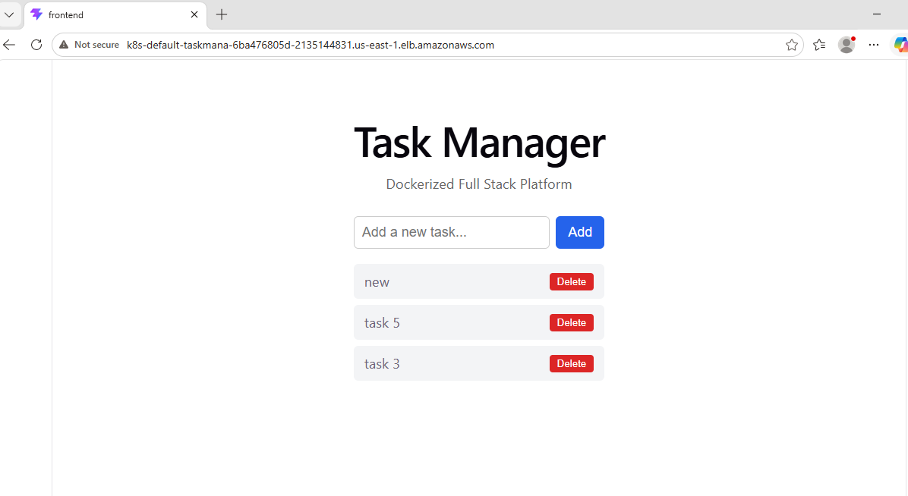
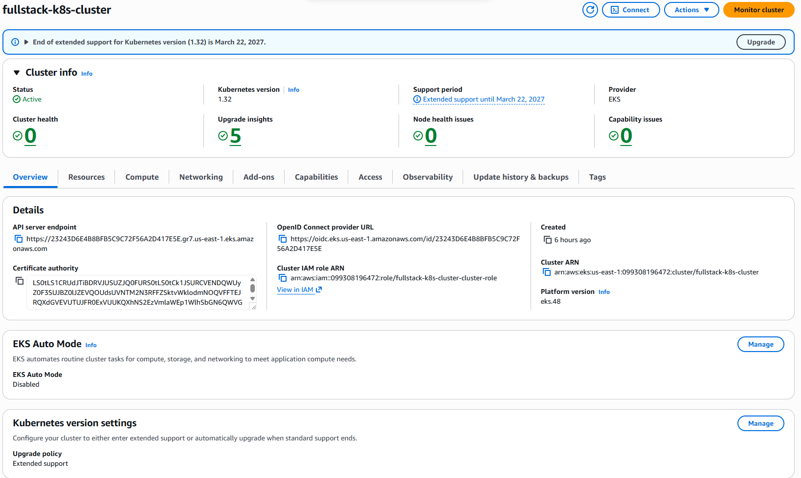
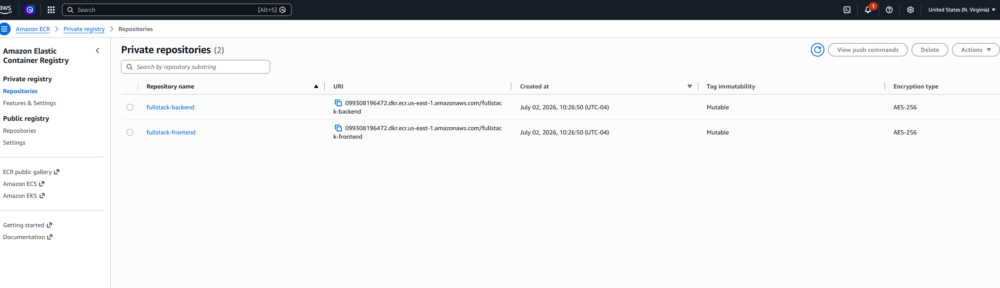
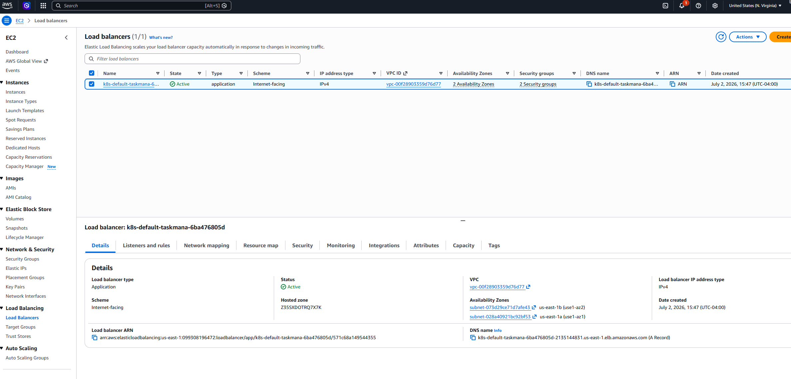
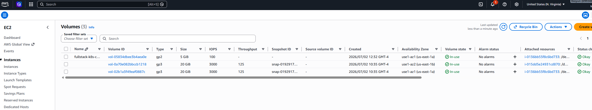
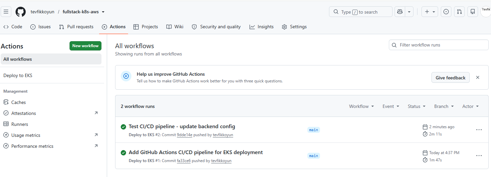

# Fullstack K8s AWS — Final Master Project

A production-style full-stack application deployed to **AWS EKS** using **Terraform** for infrastructure provisioning, **Kubernetes** manifests for orchestration, **Amazon ECR** for container registry, and **AWS ALB** for ingress — bringing together every skill from the Terraform, Docker, and Kubernetes project series.



## Architecture

```
Developer
    │
    │ git push
    ▼
GitHub
    │
    ├── GitHub Actions CI/CD
    │       ├── docker build + push → ECR
    │       └── kubectl apply → EKS
    ▼
Amazon ECR
    │ image pull
    ▼
┌─────────────────────────────────────────────────────┐
│                  AWS EKS Cluster                    │
│                                                     │
│  ┌─────────────────────────────────────────────┐    │
│  │         AWS Application Load Balancer        │    │
│  │    (created by ALB Ingress Controller)       │    │
│  └──────────────┬──────────────────────────────┘    │
│                 │                                    │
│        ┌────────┴────────┐                          │
│        │ /api/*          │ /*                       │
│        ▼                 ▼                          │
│   backend Service   frontend Service                │
│   (ClusterIP)       (ClusterIP)                     │
│        │                 │                          │
│   ┌────┴────┐       ┌────┴────┐                    │
│   │backend  │       │frontend │                     │
│   │Pod 1    │       │Pod 1    │                     │
│   │backend  │       │frontend │                     │
│   │Pod 2    │       │Pod 2    │                     │
│   └────┬────┘       └─────────┘                    │
│        │ HPA (2-5 replicas)                         │
│        ▼                                            │
│   postgres Service                                  │
│   (ClusterIP)                                       │
│        │                                            │
│   ┌────┴────┐                                       │
│   │postgres │                                       │
│   │  Pod    │                                       │
│   └────┬────┘                                       │
│        │                                            │
│   EBS Volume (5Gi gp2)                             │
│   via EBS CSI Driver                               │
└─────────────────────────────────────────────────────┘

All infrastructure provisioned with Terraform:
VPC · Subnets · EKS Cluster · Node Group
ECR Repos · IAM Roles · OIDC Provider
```

## Stack

| Layer | Technology |
|---|---|
| Infrastructure as Code | Terraform |
| Cloud | AWS (us-east-1) |
| Container Orchestration | Kubernetes (EKS v1.32) |
| Container Registry | Amazon ECR |
| Networking | VPC, public subnets (2 AZs), Internet Gateway |
| Ingress | AWS ALB Ingress Controller |
| Storage | EBS CSI Driver + PersistentVolumeClaim (gp2, 5Gi) |
| Autoscaling | Horizontal Pod Autoscaler (backend: 2-5 replicas) |
| Authentication | IAM Roles + OIDC Provider (IRSA) |
| Application | React + Node.js/Express + PostgreSQL |

## AWS Resources

**EKS Cluster** — Kubernetes v1.32, Active status, OIDC provider configured for IRSA


**Amazon ECR** — Two private repositories (`fullstack-backend`, `fullstack-frontend`) provisioned by Terraform


**AWS Application Load Balancer** — Created automatically by the ALB Ingress Controller when the Ingress resource was applied, internet-facing, spanning 2 Availability Zones


**EBS Volume** — 5Gi gp2 volume provisioned dynamically by the EBS CSI Driver for the PostgreSQL PersistentVolumeClaim


**GitHub Actions CI/CD** — Both pipeline runs successful: initial deploy and rolling update triggered by `git push`


## What Terraform provisions

```
aws_vpc                          → VPC (10.0.0.0/16)
aws_subnet (x2)                  → Public subnets in us-east-1a and us-east-1b
aws_internet_gateway             → Internet access
aws_route_table                  → Public routing
aws_eks_cluster                  → EKS control plane (K8s v1.32)
aws_eks_node_group               → EC2 worker nodes (t3.small)
aws_eks_addon (ebs-csi-driver)   → EBS volume provisioning for PVCs
aws_ecr_repository (x2)         → fullstack-backend, fullstack-frontend
aws_iam_role (x4)               → EKS cluster, nodes, EBS CSI Driver, ALB Controller
aws_iam_openid_connect_provider  → OIDC provider for IRSA
```

## Kubernetes manifests

```
k8s/
├── database/
│   ├── secret.yaml      ← PostgreSQL credentials (base64)
│   ├── pvc.yaml         ← 5Gi EBS volume claim (storageClass: gp2)
│   ├── deployment.yaml  ← postgres:16-alpine, pg_isready readiness probe, subPath mount
│   └── service.yaml     ← ClusterIP on port 5432
├── backend/
│   ├── configmap.yaml   ← DB_HOST, DB_PORT, DB_NAME, NODE_ENV
│   ├── deployment.yaml  ← Node.js, ECR image, liveness+readiness on /health
│   ├── service.yaml     ← ClusterIP on port 3000
│   └── hpa.yaml         ← CPU-based autoscaling, 2-5 replicas
├── frontend/
│   ├── deployment.yaml  ← React (nginx), ECR image, probes
│   └── service.yaml     ← ClusterIP on port 80
└── ingress/
    └── ingress.yaml     ← ALB Ingress, internet-facing, /api/* → backend, /* → frontend
```

## Key technical decisions

**IRSA (IAM Roles for Service Accounts)** — both the EBS CSI Driver and the ALB Ingress Controller authenticate to AWS using IAM roles tied to K8s service accounts via the cluster's OIDC provider. No static credentials stored anywhere in the cluster.

**EBS CSI Driver** — standard EKS clusters don't include EBS support by default. The `aws-ebs-csi-driver` addon was added to enable dynamic EBS volume provisioning for the PostgreSQL PVC. The IAM role's trust policy scopes access to `kube-system:ebs-csi-controller-sa` specifically.

**`subPath` on PostgreSQL volume** — EBS volumes include a `lost+found` directory at the root, which prevents PostgreSQL from initializing (it requires an empty directory). Mounting with `subPath: pgdata` uses a subdirectory inside the volume instead, avoiding the conflict.

**ALB Ingress Controller via Helm** — installed with Helm into `kube-system`, configured with the cluster name, VPC ID, region, and IRSA role ARN. The controller watches for `Ingress` resources with `ingressClassName: alb` and creates real AWS ALBs automatically.

**Subnet tags** — the VPC subnets are tagged with `kubernetes.io/role/elb: 1` so the ALB Controller can auto-discover which subnets to place the load balancer in. Without these tags, the controller cannot create the ALB.

**`force_delete = true` on ECR** — allows `terraform destroy` to delete ECR repositories even when images are present. Learned from `fullstack-aws-deployment`.

## Deploying

```bash
# 1. Provision infrastructure
cd terraform
terraform init
terraform apply

# 2. Configure kubectl
aws eks update-kubeconfig --region us-east-1 --name fullstack-k8s-cluster

# 3. Push images to ECR
aws ecr get-login-password --region us-east-1 | docker login --username AWS --password-stdin <account_id>.dkr.ecr.us-east-1.amazonaws.com
docker tag tevfikkoyun/fullstack-backend:latest <ecr_backend_url>:latest
docker tag tevfikkoyun/fullstack-frontend:latest <ecr_frontend_url>:latest
docker push <ecr_backend_url>:latest
docker push <ecr_frontend_url>:latest

# 4. Install ALB Ingress Controller
helm repo add eks https://aws.github.io/eks-charts
helm install aws-load-balancer-controller eks/aws-load-balancer-controller \
  -n kube-system \
  --set clusterName=fullstack-k8s-cluster \
  --set serviceAccount.create=true \
  --set serviceAccount.annotations."eks\.amazonaws\.com/role-arn"=<alb_controller_role_arn> \
  --set region=us-east-1 \
  --set vpcId=<vpc_id>

# 5. Deploy application
kubectl apply -f k8s/database/
kubectl apply -f k8s/backend/
kubectl apply -f k8s/frontend/
kubectl apply -f k8s/ingress/

# 6. Get the ALB URL
kubectl get ingress taskmanager-ingress
```

## Tearing down

```bash
# Delete K8s resources first (triggers ALB deletion by the controller)
kubectl delete -f k8s/ingress/
kubectl delete -f k8s/frontend/
kubectl delete -f k8s/backend/
kubectl delete -f k8s/database/

# Wait for ALB to be deleted, then destroy infrastructure
cd terraform
terraform destroy

```

## How this project connects the series

```
terraform-learning-labs          ← Terraform fundamentals
hybrid-infra-platform            ← Multi-tier AWS VPC, RDS, CloudWatch
cloud-resume                     ← Serverless AWS (Lambda, DynamoDB, S3, CloudFront)
        ↓
docker-mastery-labs              ← Docker fundamentals (12 labs)
dockerized-fullstack-platform    ← The application deployed here
fullstack-aws-deployment         ← Same app on EC2 (Terraform + Docker, no K8s)
        ↓
kubernetes-mastery-labs          ← Kubernetes fundamentals (12 labs)
kubernetes-task-manager          ← Same app on local K8s
kubernetes-multi-env             ← Kustomize multi-environment pattern
        ↓
fullstack-k8s-aws (this repo)   ← Everything combined: Terraform + Docker + K8s + AWS EKS
```

## Related projects

- [dockerized-fullstack-platform](https://github.com/tevfikkoyun/dockerized-fullstack-platform) — source of the container images deployed here
- [kubernetes-task-manager](https://github.com/tevfikkoyun/kubernetes-task-manager) — the same K8s manifests running on local Docker Desktop
- [fullstack-aws-deployment](https://github.com/tevfikkoyun/fullstack-aws-deployment) — the same application on EC2 without Kubernetes
- [kubernetes-mastery-labs](https://github.com/tevfikkoyun/kubernetes-mastery-labs) — the 12-lab series this project's K8s patterns build on
- [terraform-learning-labs](https://github.com/tevfikkoyun/terraform-learning-labs) — Terraform fundamentals